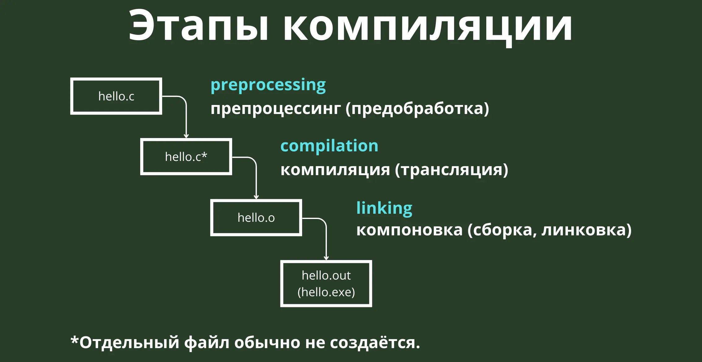

## Модульное программирование

**Модульное программирование** — это подход к разработке программ, при котором большая задача разбивается на несколько меньших, логически завершенных и взаимосвязанных частей, называемых модулями. Этот принцип был впервые сформулирован Дэвидом Парнасом в 1972 году.

### Основные свойства модулей

* Скрытие деталей реализации: Внутреннее устройство модуля скрыто от других частей программы.
* Повторное использование: Модули можно использовать в различных частях одной программы или в других проектах.

### Достоинства модульного программирования

* Упрощение проектирования, отладки и тестирования программы.
* Повышение качества кода и удобство его поддержки.
* Возможность обновления или замены модуля без изменения остальной системы.
* Облегчение коллективной разработки.

В языке Си модулем часто считают файл с исходным кодом (`.c`), объединяющий функции, определения типов данных и переменные.

## Организация модуля на языке Си

Модуль в Си обычно состоит из двух файлов с одинаковыми именами:

* **Заголовочный файл (.h):** Содержит **интерфейс** модуля. Включает прототипы функций, определения констант, объявлений глобальных переменных и определений структур, которые должны быть доступны другим модулям.
    * **Защита от повторного включения:** Для предотвращения ошибок при многократном включении одного и того же заголовочного файла используется условная компиляция с директивами препроцессора `#ifndef`, `#define` и `#endif`.

    ```c
    #ifndef MY_MODULE_H
    #define MY_MODULE_H

    // Прототипы функций
    void my_function1();
    int my_function2(int);

    // Определение структуры (если нужно)
    typedef struct MyStruct MyStruct;

    #endif // MY_MODULE_H
    ```

* **Файл с исходным кодом (.c):** Содержит **реализацию** модуля. Включает определения всех функций, объявленных в заголовочном файле, а также определения глобальных переменных и констант, используемых только внутри модуля. Обычно в первой строке подключается собственный заголовочный файл (`#include "module.h"`).

    ```c
    #include "my_module.h"
    #include <stdio.h> // Пример включения стандартной библиотеки, если нужна для реализации

    // Реализация функций
    void my_function1() {
        printf("Привет из my_function1!\n");
    }

    int my_function2(int x) {
        return x * 2;
    }
    ```

Главный модуль программы (`main.c`) обычно содержит только функцию `main()` и не имеет заголовочного файла, так как `main()` не используется другими модулями. Он подключает заголовочные файлы тех модулей, функциональность которых использует.

## Инкапсуляция в Си

**Инкапсуляция** — это принцип, который позволяет объединить данные и функции, работающие с этими данными, в единое целое и скрыть детали реализации от внешнего доступа. Хотя Си не является объектно-ориентированным языком в классическом понимании, инкапсуляцию можно реализовать.

### Основные аспекты инкапсуляции в Си

* **Скрытие данных:** Внутренние данные модуля (например, поля структуры) могут быть скрыты от прямого доступа, например, путем объявления структуры в заголовочном файле с использованием `typedef`, но без описания ее полей. Детали структуры описываются только в файле реализации (`.c`).

    ```c title="bank_account.h"
    #ifndef BANK_ACCOUNT_H
    #define BANK_ACCOUNT_H

    typedef struct BankAccount BankAccount; // Объявление структуры без деталей

    // Прототипы функций для работы со счетом
    BankAccount* create_account(double initial_balance);
    void deposit(BankAccount* account, double amount);
    double get_balance(BankAccount* account);
    void free_account(BankAccount* account);

    #endif // BANK_ACCOUNT_H
    ```

    ```c title="bank_account.c"
    #include "bank_account.h"
    #include <stdlib.h> // Для malloc и free
    #include <stdio.h> // Для printf

    // Определение структуры (скрыто от пользователей модуля)
    struct BankAccount {
        double balance;
    };

    // Реализация функций
    BankAccount* create_account(double initial_balance) {
        BankAccount* account = (BankAccount*)malloc(sizeof(BankAccount));
        if (account) {
            account->balance = initial_balance;
        }
        return account;
    }

    void deposit(BankAccount* account, double amount) {
        if (amount > 0) {
            account->balance += amount;
        }
    }

    void withdraw(BankAccount* account, double amount) {
        if (amount > 0 && amount <= account->balance) {
            account->balance -= amount;
        } else {
            printf("Недостаточно средств для снятия.\n");
        }
    }

    double get_balance(BankAccount* account) {
        return account->balance;
    }

    void free_account(BankAccount* account) {
        free(account);
    }
    ```

* **Создание интерфейса:** Модуль предоставляет набор функций (через заголовочный файл), которые являются единственным способом взаимодействия с его данными. Пользователь вызывает эти функции, не имея прямого доступа к внутреннему представлению данных.

    ```c title="main.c"
    #include <stdio.h>
    #include "bank_account.h"

    int main() {
        BankAccount* my_account = create_account(100.0);
        printf("Баланс: %.2f\n", get_balance(my_account)); // Доступ к данным только через функцию

        deposit(my_account, 50.0);
        printf("Баланс после депозита: %.2f\n", get_balance(my_account));

        withdraw(my_account, 30.0);
        printf("Баланс после снятия: %.2f\n", get_balance(my_account));

        /* Попытка снять больше, чем на счете: */
        withdraw(my_account, 150.0);

        // Прямой доступ к account->balance невозможен из main.c

        // Освобождение памяти
        free_account(my_account);

        return 0;
    }
    ```

### Преимущества инкапсуляции

* Безопасность данных: Защита данных от некорректного прямого изменения.
* Упрощение использования: Пользователю доступен только четкий интерфейс.
* Легкость модификации: Изменение внутренней реализации модуля не влияет на код, который его использует, если интерфейс остается прежним.

### Приватные переменные и функции в Си

По умолчанию переменные, определенные вне функций, имеют область видимости в пределах файла. Функции по умолчанию являются внешними (`extern`) и видимы во всей так называемой единице трансляции.

Для создания "приватных" (доступных только внутри файла) переменных или функций используется ключевое слово `static`. Использование `static` при определении функции ограничивает ее видимость до файла, в котором она определена.

## Препроцессор и Макросы

**Препроцессор** — это специальная программа, которая обрабатывает исходный код до его компиляции. Он выполняет текстовые подстановки и условную компиляцию на основе директив, начинающихся с символа `#`.

### Основные директивы препроцессора

* `#include`: Включает содержимое указанного файла в текущий. Используется для подключения заголовочных файлов.
    * `#include "filename.h"`: Ищет файл в текущем каталоге или каталогах, указанных при компиляции.
    * `#include <filename.h>`: Ищет файл в стандартных системных каталогах для заголовочных файлов.
* `#define`: Определяет макрос или символическую константу. Препроцессор заменит каждое вхождение `Идентификатор` на `Замена` в коде.

    ```c
    #define MAX_SIZE 100
    #define PI 3.14159
    #define SUM(x, y) ((x) + (y)) // Макрос с параметрами. Скобки важны!
    ```

* `#undef`: Отменяет предыдущее определение макроса, созданного с помощью `#define`. После этой директивы препроцессор перестает выполнять замену для данного идентификатора.

    ```c
    #undef MAX_SIZE
    ```

* Условная компиляция (`#ifdef`, `#ifndef`, `#if`, `#elif`, `#else`, `#endif`): Позволяет включать или исключать блоки кода в зависимости от определенных условий (например, определен ли макрос). Это часто используется для кроссплатформенной разработки или защиты от повторного включения заголовочных файлов.

    ```c
    #ifdef DEBUG
        printf("Отладочное сообщение.\n");
    #endif

    #ifndef __STDC__
    #error "Компилятор не соответствует стандарту ANSI C."
    #endif
    ```

* `#line`: Изменяет номер текущей строки и имя компилируемого файла для отладки.
* `#error`: Вызывает ошибку компиляции с указанным сообщением.
* `#pragma`: Директива, специфичная для конкретной реализации компилятора. Используется для передачи компилятору специфических инструкций (например, по выравниванию данных или управлению предупреждениями). Если компилятор не распознает директиву `#pragma`, он ее игнорирует (хотя некоторые могут выдавать предупреждение).

??? note "Куча текста про условную компиляцию"
    Директивы условной компиляции (`#ifdef`, `#ifndef`, `#if`, `#elif`, `#else`, `#endif`): Эти директивы позволяют включать или исключать блоки исходного кода из процесса компиляции в зависимости от определенных условий.

    * `#ifdef name`: Код между `#ifdef` и соответствующим `#endif` будет включен, если макрос `name` определен с помощью `#define`.
    * `#ifndef name`: Код будет включен, если макрос `name` *не* определен. Часто используется для защиты заголовочных файлов от многократного включения.
    * `#if expr`: Код будет включен, если константное выражение `expr` истинно (не равно нулю).
    * `#elif expr`: Сочетание `else` и `if`. Проверяет условие, если предыдущие `#if` или `#elif` были ложными.
    * `#else`: Код между `#else` и `#endif` будет включен, если ни одно из предыдущих условий в блоке условной компиляции не было истинным.
    * `#endif`: Обозначает конец блока условной компиляции.

    ```c
    #ifdef DEBUG
        // Этот код компилируется только при определенном DEBUG
        printf("Отладочное сообщение.\n");
    #else
        // Этот код компилируется, если DEBUG не определен
        // ... основной код
    #endif
    ```
    Это полезно для включения отладочного кода, кода для разных операционных систем или версий программы[cite: 167].

### Макросы против функций

Макросы выполняют текстовую подстановку на этапе препроцессинга. Функции же имеют собственный стековый кадр и выполняются во время выполнения программы. Использование макросов может быть быстрее в некоторых случаях, но они не имеют контроля типов и могут приводить к неожиданным побочным эффектам, особенно при использовании операций инкремента/декремента в параметрах.

## Процесс сборки программы: Компиляция и Компоновка

Превращение исходного кода на Си в исполняемую программу — это многоступенчатый процесс, который наглядно иллюстрирует предоставленная схема. Понимание этих этапов критически важно для контроля сборки и отладки.



Как показано на схеме, процесс состоит из последовательных преобразований вашего кода:

1.  **Препроцессинг (Preprocessing):** Этот начальный этап обрабатывает директивы препроцессора (начинающиеся с `#`) в вашем исходном файле (например, `hello.c`). Выполняется включение содержимого заголовочных файлов (`#include`), развертывание макросов (`#define`) и обработка условной компиляции. На схеме показан переход от `hello.c` к `hello.c*`, который символизирует результат предобработки. Важно отметить, что **отдельный файл для `hello.c*` обычно не создается**; препроцессор сразу передает результат компилятору.
2.  **Компиляция (Compiling):** Компилятор берет результат препроцессинга (`hello.c*`) и переводит его в машинный код. Для каждого файла реализации (`.c`) создается отдельный **объектный файл** (на схеме `hello.o`), содержащий машинные инструкции для данного модуля. На этом этапе проверяется синтаксис и выявляются ошибки компиляции. Объектные файлы пока не являются самостоятельными исполняемыми программами, поскольку в них еще не разрешены ссылки на функции и данные из других модулей или библиотек.
3.  **Связывание/Компоновка (Linking):** На финальном этапе компоновщик собирает все объектные файлы вашей программы (например, `hello.o`) вместе с необходимым кодом из **библиотек** (стандартных или сторонних). Он разрешает все ссылки между различными частями программы, находя фактические адреса функций и данных. Результатом этого этапа является **исполняемый файл** (на схеме `hello.out`, который в Windows обычно имеет расширение `.exe`), полностью готовый к запуску. Ошибки связывания происходят, если компоновщик не может найти определение для используемого символа.

Этот процесс позволяет собрать программу из независимых модулей и готовых библиотечных компонентов в единое целое.

### Самостоятельное выполнение этапов сборки (с использованием GCC)

Для лучшего понимания или отладки можно выполнять эти этапы по отдельности с помощью компилятора GCC:

* **Препроцессинг:**
    `gcc -E ваш_файл.c -o ваш_файл.i` (сохраняет результат препроцессинга в файл `.i`, позволяя его просмотреть)
* **Компиляция (в объектный код):**
    `gcc -c ваш_файл.c -o ваш_файл.o` (создает объектный файл `.o` из файла `.c`). Эту команду нужно повторить для каждого файла реализации.
* **Связывание/Компоновка (в исполняемый файл):**
    `gcc файл1.o файл2.o ... -o ваша_программа` (компонует указанные объектные файлы и создает исполняемый файл).

Выполнение этих команд пошагово помогает увидеть промежуточные результаты каждого этапа сборки.

## Сцепление и Связность

Эти два понятия важны при проектировании модулей.

* **Сцепление (Cohesion):** Описывает, насколько элементы внутри модуля связаны между собой и работают для достижения единой цели. **Высокое сцепление** является желательным, когда все элементы модуля логически связаны и выполняют схожие задачи (например, все функции в модуле `math_utils` связаны с математическими операциями).
* **Связность (Coupling):** Описывает степень зависимости между различными модулями. **Низкая связность** является желательной, когда модули минимально зависят друг от друга, что упрощает их тестирование, изменение и повторное использование. Взаимодействие модулей должно происходить через четко определенные интерфейсы (заголовочные файлы), а не через прямое обращение к внутренним данным или деталям реализации другого модуля.

Стремление к высокому сцеплению внутри модулей и низкой связности между ними является ключевым для создания хорошо структурированного, поддерживаемого и расширяемого программного обеспечения.